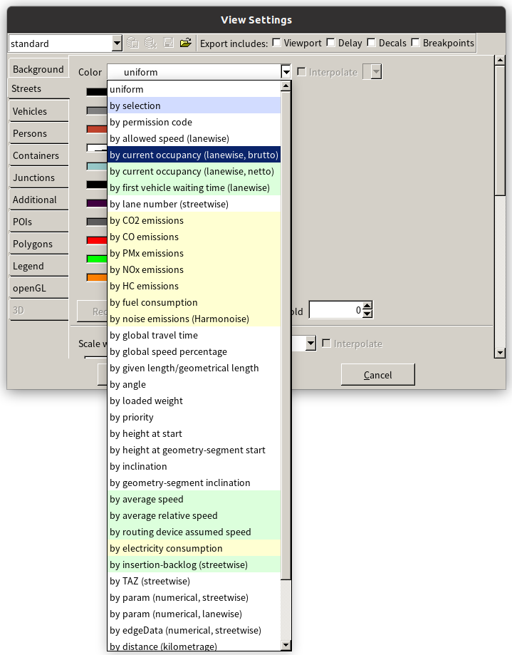

# Tabular Traffic Flow Model Guided Path Planning with Connected Vehicles

The data of network (`SUMOFiles/node.csv`, `SUMOFiles/link.csv`, `SUMOFiles/demand.csv`) are obtained from [DTALite/Lima_network](https://github.com/asu-trans-ai-lab/DTALite/tree/main/dataset/08_Lima_network).

# Usage

**Caution please: If you just want to see the performance of our model, you can skip to the section `Run the model`, since all the files have already been generated in this repository.**

At first, we should build the network from `SUMOFiles/node.csv` and `SUMOFiles/link.csv`. The follow instructions can help finish it:

```bash
cd SUMOFiles/
python genNetFile.py   # This script will generate lima.nod.xml and lima.edge.xml
netconvert -n lima.nod.xml -e lima.edge.xml -o lima.net.xml
```

Then, we will get route file from `SUMOFiles/demand.csv` with `od2trips` and `duarouter`.

> Duarouter has two main purposes: Computing fastest/optimal routes directly as well as iteratively in the context of Dynamic_User_Assignment.

```bash
cd pathPlanner/
python buildTopologyM.py   # This script can generate lima.add.xml with TAZ-zones
cd ../SUMOFiles/
python genTrips.py   # This script can generate lima.od.xml
od2trips -n lima.net.xml,lima.add.xml --od-amitran-files lima.od.xml -o lima.trips.xml
duarouter -n lima.net.xml -d lima.add.xml -t lima.trips.xml -o lima.rou.xml
```

Next, we can generate route file with our `TTFMGPP`. In fact, you can use `traci.vehicle.setRoute()` to change vehicles' routes when they enter the network, but `traci` can slow down the simulation speed of SUMO, so we suggest generate route file as a pre-process.

```bash
cd SUMOFiles/getSSD/
# The follow script can generate ../SSD.json, which is too large to upload to github, so you should generate it by yourself.
python StaticShortestDistance.py   
cd ../../pathPlanner/
python TTFMGpathPlanner.py   # This script will generate the SUMOFiles/TTFMGPP.rou.xml.
```

# Run the model

Finally, you can compare the effects of `duarouter` and our `TTFMGPP` with `sumo-gui`.

```bash
sumo-gui -n lima.net.xml -r lima.rou.xml -a duarouter.add.xml --tripinfo-output duarouter.tripinfo.xml
# This instruction will generate duarouter.edgesinfo.xml and duarouter.tripinfo.xml additionally. which can help you analyze the efficiency.
```

```bash
sumo-gui -n lima.net.xml -r lima.rou.xml -a TTFMGPP.add.xml --tripinfo-output TTFMGPP.tripinfo.xml
```

If you want to see the heatmap of road occupancy, click the `Edit Coloring Schemes` with an icon like  at the left top in `sumo-gui`. Then click tab `Streets` and change `color` to `by current occupancy (lanewise, brutto)`, as the follow figure shows.


